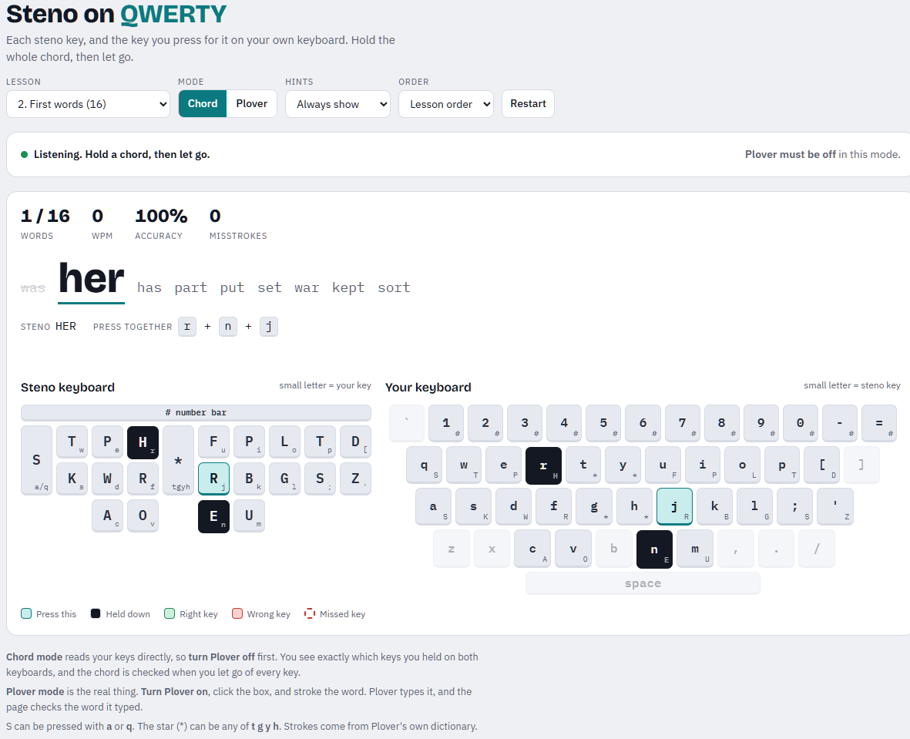

# Steno on QWERTY

A practice page for learning stenography with [Plover](https://www.openstenoproject.org/plover/) on a normal keyboard.

Most steno lessons show the steno layout (`S T K P W H R ...`), which tells you nothing about which keys to press on a QWERTY keyboard. This page puts the steno board and a QWERTY keyboard side by side, labels every key with its partner, and lights up the keys for each word on both.

**Use it in your browser:** https://shaafijahangir.github.io/steno-trainer/



## What you need

1. **A keyboard that registers many keys at once.** A steno chord can be 10 or more keys pressed together. Many cheap keyboards stop at 6, and Plover won't work on those. Look for "NKRO" (N-key rollover) in the specs, and use the cable rather than wireless if your keyboard has both. See [Check your keyboard](#check-your-keyboard) to test it.
2. **Plover**, the free steno program. Download it from the [Plover releases page](https://github.com/opensteno/plover/releases) and install it. It runs on Windows, macOS and Linux.
3. **A modern browser.** Chrome, Edge, Firefox or Safari.

## Set up Plover

1. Open Plover.
2. Click **Configure**, then the **Machine** tab, and set the machine to **Keyboard**. This is the default.
3. Click **Apply** and **OK**.
4. In the main Plover window, **Enable** turns steno on and **Disable** turns it off. While it's enabled, your keyboard types steno instead of normal letters.

To check that Plover works, enable it, open Notepad, and press `w` `n` `u` `p` together, then let go. It should type **test**.

## How to practise

Open the page and pick a lesson. There are two modes.

### Chord mode (start here)

The page reads your keys itself, so **Plover must be disabled**.

1. Click anywhere on the page.
2. Hold down every highlighted key at the same time, then let go of all of them.
3. The page checks the chord when the last key comes up. Right keys turn green, wrong keys red, and keys you missed get a dashed outline.

You don't need to press the keys at exactly the same moment. Only the full set of keys you held before letting go counts.

### Plover mode (once you know the keys)

This is real steno. **Plover must be enabled.**

1. Click the text box.
2. Stroke the word. Plover types it into the box, and the page checks that it's the right word.

### Lessons

| Lesson | What it teaches |
| --- | --- |
| 1. Find the keys | Each of the 22 steno keys on its own. Chord mode only. |
| 2. First words | 16 simple one-stroke words: was, her, has, part, put... |
| 3. 100 common words | The most common English words, many as short "briefs" (*the* = `-T`, *and* = `SKP`). |

All strokes come from Plover's default dictionary, so what you learn here works in Plover.

Other settings:

- **Hints:** *Always show*, or *After a mistake* to test yourself.
- **Order:** lesson order, or shuffled.
- At the end of a lesson you can practise only the words you got wrong.

## The key map

This is Plover's default layout for a QWERTY keyboard. The page shows it on the keyboards themselves; the table is here for reference.

| Steno key | QWERTY key | | Steno key | QWERTY key |
| --- | --- | --- | --- | --- |
| S- | `a` or `q` | | -F | `u` |
| T- | `w` | | -R | `j` |
| K- | `s` | | -P | `i` |
| P- | `e` | | -B | `k` |
| W- | `d` | | -L | `o` |
| H- | `r` | | -G | `l` |
| R- | `f` | | -T | `p` |
| A- | `c` | | -S | `;` |
| O- | `v` | | -D | `[` |
| * | `t` `g` `y` or `h` | | -Z | `'` |
| -E | `n` | | # (number bar) | any number key |
| -U | `m` | | | |

## Check your keyboard

On Windows, with Python installed, run:

```
python tools/nkro_test.py 20
```

For 20 seconds, hold down as many letter keys as you can with both hands. The last line shows the most keys your keyboard registered at once.

- **10 or more:** good for steno.
- **6:** your keyboard has 6-key rollover. Check its manual for an NKRO setting, try the cable instead of wireless, or use a different keyboard.

On other systems, search for "keyboard rollover test" and use any online tester.

## Run it offline

The page is a single file. Download `index.html` and open it in your browser. It needs an internet connection only for its fonts, and works without them.

## Where to learn more

- [Typey Type](https://didoesdigital.com/typey-type/): a full steno course with many more lessons.
- [Art of Chording](https://www.artofchording.com/): a free book on how steno theory works.
- [Plover wiki](https://plover.wiki/): setup help for Plover.

## Credits and license

Stroke data and the QWERTY key map come from [Plover](https://github.com/opensteno/plover), which is GPL-2.0-or-later. This project uses the same license; see [LICENSE](LICENSE).
